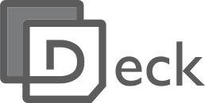
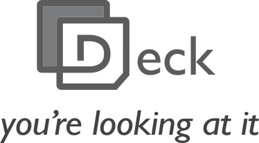
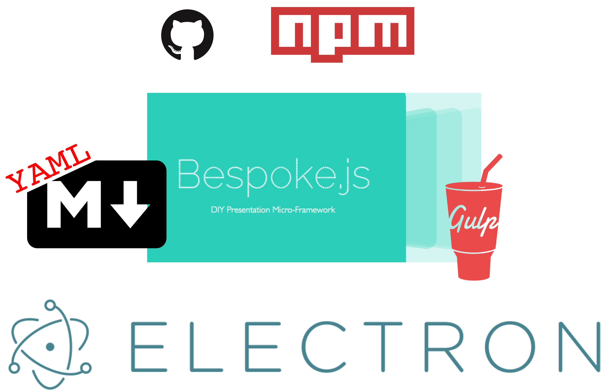

<!--
master: section-title
custom: 
  0: 
    margin-top: -1em
    margin-bottom: .5em

  1:
    width: 60%
    img:
      width: 100%
notes: |
  Room stats - who presents
-->

# introducing...




---
<!--
master: bullets
notes: |
  Room stats 
    - who has given a similar talk twice but with slightly diff slides 
    - who has collab'd on slides 
      - over longer period of time

  re workflow - I wrote these slides on iPhone notes 
  whilst on short flight from NI to heathrow.
-->

# Workflow

* create an outline
* fill it in/flesh it out
* generally use markdown-esque syntax
* transfer outline into Keynote or Powerpoint (painful) 

---
<!--
master: bullets
-->

# Keynote / PowerPoint

* easy to get started
* application 
  * dual screen, access file system, open file with 
* easily convert to PDF format for distribution 
* concept of "master slides" for easy layout reuse
* Keynote adds a pleasant aesthetic and feel to slides

---
<!--
master: bullets
-->

# Keynote / PowerPoint

* tied to OS
* hard to track changes over time
  * Keynote has a binary format  
    * changes without notice 
  * Powerpoint has an XML format
    * horrible to version control
* outline transfer is painful 
  * particularly from markdown 
* have to exit presentation to do demos 

---
<!--
master: bullets
-->

# Bespoke.js

* supports markdown 
* open source
* embed demos in the presentation
* applying version control is possible because of all text source
* Essentially a web page, so can be accessed online

---
<!--
master: bullets
-->

# Bespoke.js

* learning curve 
  * need to be a web dev
* dual screen is fiddly
* have to theme it yourself
  * themes not as nice as Keynote
* have to build a dist
* No easy handout format (e.g. PDF)
* I want my slides to just contain content
  * No web site boilerplate


---
<!--
master: image
custom:
  1:
    width: 70%
    margin-top: 2.5em
-->

# Deck



---
<!--
master: command-bullets
-->

# Deck


```sh
$ npm i -g @deck/app # npm 2+
$ npm i -g deck-app # npm 1/node 0.10
```

* CLI application for content management
* GUI application for presentation
  * built for extended-display
* multi-platform (Linux, Mac, Windows)
* multiversion (Node 0.10, 0.12, & 4)

---
<!--
master: command-bullets
-->

# Deck

```sh
$ npm i -g @deck/app # npm 2+
$ npm i -g deck-app # npm 1/node 0.10
```

* multi-device
* networked application
  * slide synchronization
  * graceful live reload
  * tunnelling
* markdown driven (GFM)

---
<!--
master: image
custom:
  1:
    margin-top: .5em

-->

# Anatomy



---
<!--
master: image
custom:
  1:
    margin-top: 3.75em
notes: |
 originally written with nw.js

-->

# Electron vs NW.js


---
<!--
master: command-command-command-bullets
-->

# Content Modules

```sh
deck init
```
```sh
deck install
```
```sh
deck publish
```

* A slide deck is simply a module with `deck.md` as the main file 
* Slide decks can be install from npm (or a private repo) and then presented
* You can also simply clone from a git repo and then run `deck present` within that repo

---
<!--
master: command-command-bullets
custom:
  1:
    code:
      font-size: 0.85em
  2:
    code:
      font-size: 0.85em
-->

# Content Modules

```sh
npm dist-tag add my-deck@2.3.2 advanced
npm dist-tag add my-deck@1.1.4 standard
```
```sh
npm dist-tag add collab-deck@1.2.5 dave
npm dist-tag add collab-deck@1.1.4 matteo
```

* We can use npm tags to install slide deck content variations
* We map these npm tags to git branches

---
<!--
master: bullets
-->

# Content Modules

* For version convention we've informally re-purposed semver as "seshver"
  * Patch version is for typos etc
  * Minor version is content mutations
  * Major version denotes estimated duration in "session" units
    * context-relative: for a talk a session could be 10min, for training it could be 90min


---
<!--
master: command-bullets
-->

# Deck Upstream

```sh
deck upstream
```

* `deck upstream` automatically create a pull-request from content changes even if edits are made against an installed module instead of a git repo
* the idea is to make it trivial for anyone delivering our content to feedback
* easy editing with `cmd + e`

---
<!--
master: bullets
-->

# Slide Control

* Slides are separated by the markdown HR line `---`
  * This leads to neat output for normal markdown rendering (e.g on GitHub)
* Each slide can have a comment header where meta data and instructions can go
  * `master` - sets the master slide format
  * `notes` - supply slide notes
  * `custom` - tweak slide layout with CSS

---
<!--
master: bullets
-->

# Skins

* During `deck init` you can supply a skin
* A skin is simply CSS providing styles on top of bespoke
  * Deck supports/expects the Stylus `.styl` format but generally Stylus can be written exactly like CSS if preferred
* Only one public skin `@deck/skin-light`
  * Attempts to capture Keynote look and feel at a basic level
  * Meant for forking and customising

---
<!--
master: bullets
-->

# Demos

* Live coding is typically fiddly when attempted along side Keynote or Powerpoint
  * This is why most speakers either do one or the other
  * In training scenarios you *really* need both
* Deck supports demos by broadcasting the primary screen into the actual presentation
* `ctrl + cmd + b`

---
<!--
master: bullets
-->

# PDF's

* `ctrl + cmd + p`
* loops through all the slides, takes pictures and streams to a PDF file
* generated files aren't small, but it's a start

---
<!--
master: bullets
-->

# The Presenter

* When a slide deck is initialized it includes the `@deck/present` dependency
* `@deck/present` is simply an executable that's responsible for starting a server for the GUI (and audience) to connect to
* This means it can be replaced with your own custom Bespoke setup
  * Or something entirely different.


---
<!--
master: bullets
-->

# Project Status

* Launching today... Now.... It's launched.
* OPEN open project
  * Any non-trivial PR will automatically be given collaborator perms
* nearForm is currently using it (literally, right now, as we speak) to deliver training to clients
* Our role now is to mostly focus on bug fixing, cross-platform consistency and documentation
* Happy to incorporate new features in the form of PR's though ;)

---
<!--
master: bullets
-->

# Project Future/Ideas

* Docs
* Incorporate generic tunnelling service (ngrok)
* Application Packaging
  * Reduce the learning curve further
* Easier slide customisation format
* Implicit master slides based on content
  * System guesses the correct class to apply
* Optimize presentation boot up
* Cross-platform font


---
<!--
master: bullets
-->

# Project Future/Ideas
* GUI for content management
* GUI for content creation/editing
  * Dynamically Switch between editable markdown and HTML output within the GUI display
* Integration (gh-pages, slide-share, ...)
* Dynamic port assignment strategy
* More skins
* Configuration story (preferences etc.)
   
---
<!--
master: bullets
-->

# Summary

* It's getting easier and easier to cater to niche areas with JS
* There is a place for Networked Desktop applications within the full stack JS context

---
<!--
master: title-page
-->

# Thanks
## @davidmarkclem
